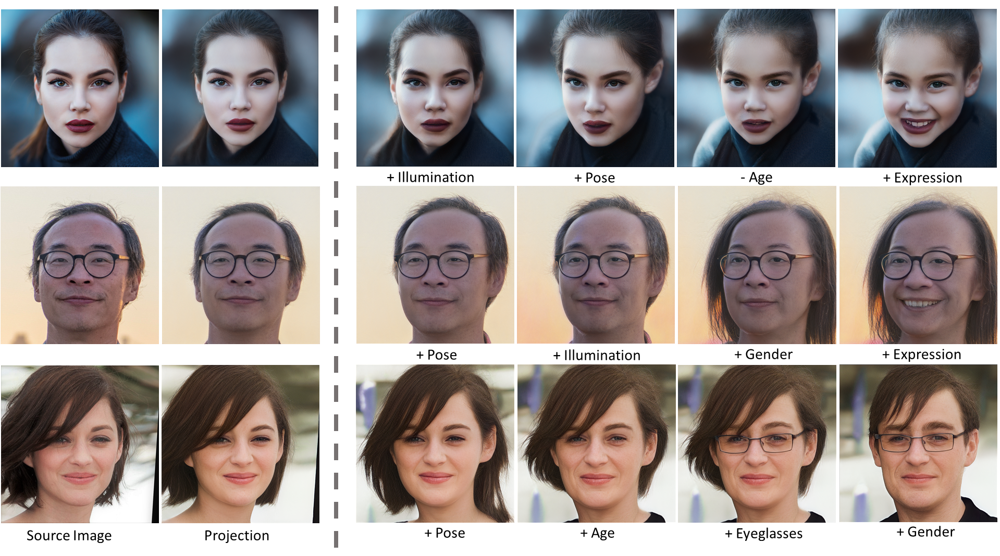
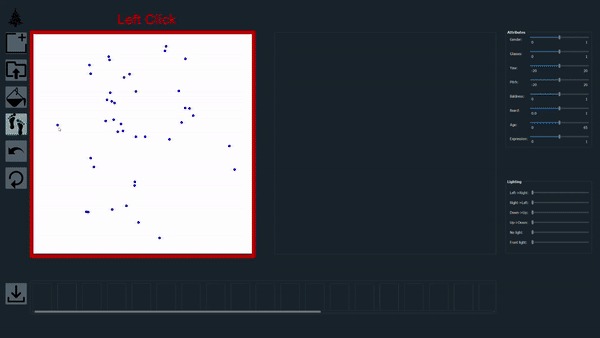
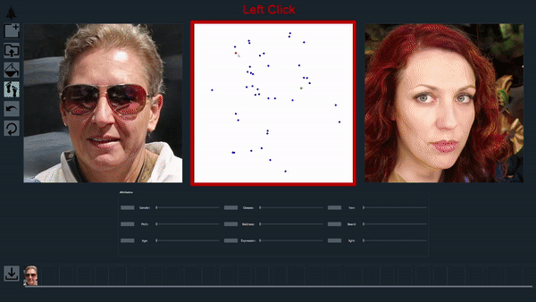

# StyleFlow: Attribute-conditioned Exploration of StyleGAN-Generated Images using Conditional Continuous Normalizing Flows (ACM TOG 2021)
## See you @ Siggraph 2021



**Figure:** *Sequential edits using StyleFlow*

High-quality, diverse, and photorealistic images can now be generated by unconditional GANs (e.g., StyleGAN). However, limited options exist to control the generation process using (semantic) attributes, while still preserving the quality of the output. Further, due to the entangled nature of the GAN latent space, performing edits along one attribute can easily result in unwanted changes along other attributes. In this paper, in the context of conditional exploration of entangled latent spaces, we investigate the two sub-problems of attribute-conditioned sampling and attribute-controlled editing. We present StyleFlow as a simple, effective, and robust solution to both the sub-problems by formulating conditional exploration as an instance of conditional continuous normalizing flows in the GAN latent space conditioned by attribute features. We evaluate our method using the face and the car latent space of StyleGAN, and demonstrate fine-grained disentangled edits along various attributes on both real photographs and StyleGAN generated images. For example, for faces, we vary camera pose, illumination variation, expression, facial hair, gender, and age. Finally, via extensive qualitative and quantitative comparisons, we demonstrate the superiority of StyleFlow to other concurrent works.

> **StyleFlow: Attribute-conditioned Exploration of StyleGAN-Generated Images using Conditional Continuous Normalizing Flows (ACM TOG 2021)** <br>
>  Rameen Abdal, Peihao Zhu, Niloy Mitra, Peter Wonka <br>
>  KAUST, Adobe Research <br>


[[Paper](https://arxiv.org/pdf/2008.02401.pdf)]
[[Project Page](https://rameenabdal.github.io/StyleFlow/)]
[[Demo](https://youtu.be/LRAUJUn3EqQ)]
[[Promotional Video](https://youtu.be/Lt4Z5oOAeEY)]


## Installation

Clone this repo.
```bash
git clone https://github.com/RameenAbdal/StyleFlow.git
cd StyleFlow/
```

This code requires PyTorch, TensorFlow, Torchdiffeq, Python 3+ and Pyqt5. Please install dependencies by
```bash
conda env create -f environment.yml
```

StyleGAN2 relies on custom TensorFlow ops that are compiled on the fly using [NVCC](https://docs.nvidia.com/cuda/cuda-compiler-driver-nvcc/index.html). To correctly setup the StyleGAN2 generator follow the **Requirements** in [this repo](https://github.com/NVlabs/stylegan2).

## Installation (Docker)

Clone this repo.

```bash
git clone https://github.com/RameenAbdal/StyleFlow.git
cd StyleFlow/
```

You must have CUDA (>=10.0 && <11.0) and [nvidia-docker2](https://github.com/NVIDIA/nvidia-docker) installed first !

Then, run :

```bash
xhost +local:docker # Letting Docker access X server
wget -P stylegan/ http://d36zk2xti64re0.cloudfront.net/stylegan2/networks/stylegan2-ffhq-config-f.pkl
docker-compose up --build # Expect some time before UI appears
```

When finished, run :

```bash
xhost -local:docker
```

## UI Illustration

 


**Loading images may take 2 - 3 seconds on the first click. Move the slider smoothly to render results.**


## Editing Images Using Pretrained Models


1.  Run the main UI

    ``` bash
	python main.py
    ```

2. Run the Attribute Transfer UI
	```bash
   python main_attribute.py 
    ```

## Web UI (Beta)
A web based UI is also now available. Follow [webui](https://github.com/RameenAbdal/StyleFlow/tree/webui) dev branch for setup.


## Training New Model
Dataset containing sampled StyleGAN2 latents, lighting SH parameters and other attributes. ([Download Here](https://drive.google.com/file/d/1ISlGiys184wHO5nBB6dIVCrQHYe7QEpY/view?usp=sharing))

Training code: To be added


## License

All rights reserved. Licensed under the [CC BY-NC-SA 4.0](https://creativecommons.org/licenses/by-nc-sa/4.0/legalcode) (**Attribution-NonCommercial-ShareAlike 4.0 International**). The code is released for academic research use only.

## Citation
If you use this research/codebase/dataset, please cite our papers.
```
@article{abdal2020styleflow,
  title={Styleflow: Attribute-conditioned exploration of stylegan-generated images using conditional continuous normalizing flows},
  author={Abdal, Rameen and Zhu, Peihao and Mitra, Niloy and Wonka, Peter},
  journal={arXiv e-prints},
  pages={arXiv--2008},
  year={2020}
}
```
```
@INPROCEEDINGS{9008515,
  author={R. {Abdal} and Y. {Qin} and P. {Wonka}},
  booktitle={2019 IEEE/CVF International Conference on Computer Vision (ICCV)}, 
  title={Image2StyleGAN: How to Embed Images Into the StyleGAN Latent Space?}, 
  year={2019},
  volume={},
  number={},
  pages={4431-4440},
  doi={10.1109/ICCV.2019.00453}}
```

## Broader Impact
*Important* : Deep learning based facial imagery like DeepFakes and GAN generated images can be gravely misused. This can spread misinformation and lead to other offences. The intent of our work is not to promote such practices but instead be used in the areas such as identification (novel views of a subject, occlusion inpainting etc. ), security (facial composites etc.), image compression (high quality video conferencing at lower bitrates etc.) and development of algorithms for detecting DeepFakes.

## Acknowledgments
This implementation builds upon the awesome work done by Karras et al. ([StyleGAN2](https://github.com/NVlabs/stylegan2)), Chen et al. ([torchdiffeq](https://github.com/rtqichen/torchdiffeq)) and Yang et al. ([PointFlow](https://arxiv.org/abs/1906.12320)). This work was supported by Adobe Research and KAUST Office of Sponsored Research (OSR).
