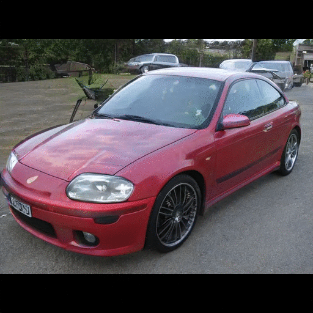
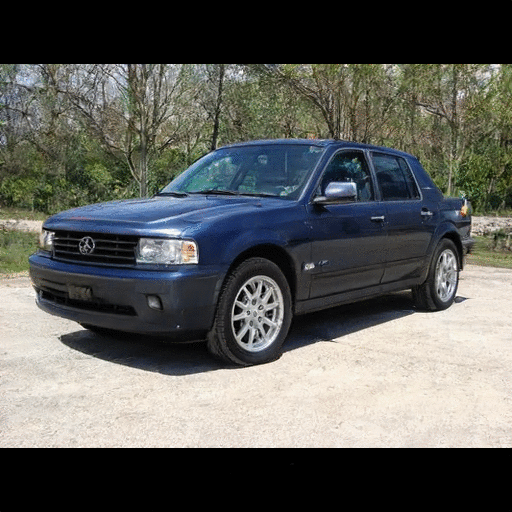
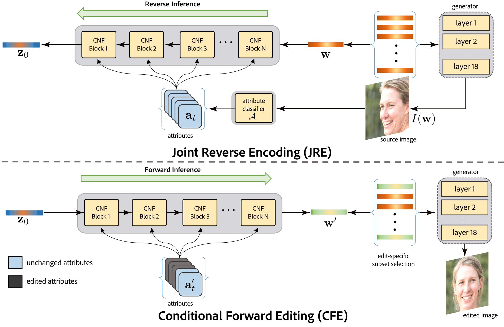
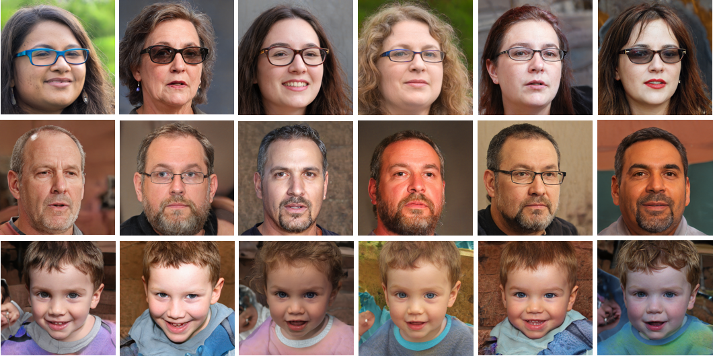
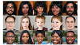

<h1>Abstract</h1>
 

 

High-quality, diverse, and photorealistic images can now be generated by unconditional GANs (e.g., StyleGAN). However, limited options exist to control the generation process using (semantic) attributes, while still preserving the quality of the output. Further, due to the entangled nature of the GAN latent space, performing edits along one attribute can easily result in unwanted changes along other attributes. In this paper, in the context of conditional exploration of entangled latent spaces, we investigate the two sub-problems of attribute-conditioned sampling and attribute-controlled editing. We present StyleFlow as a simple, effective, and robust solution to both the sub-problems by formulating  conditional exploration as an instance of conditional continuous normalizing flows in the GAN latent space conditioned by attribute features. We evaluate our method using the face and the car latent space of StyleGAN, and demonstrate fine-grained disentangled edits along various attributes on both real photographs and StyleGAN generated images. For example, for faces we vary camera pose, illumination variation, expression, facial hair, gender, and age. Finally, via extensive qualitative and quantitative comparisons, we demonstrate the superiority of StyleFlow to other concurrent works. 

<h1>Overview Video</h1>
 

  

<iframe width="560" height="315" src="https://www.youtube.com/embed/LRAUJUn3EqQ" frameborder="0" allow="accelerometer; autoplay; encrypted-media; gyroscope; picture-in-picture" allowfullscreen></iframe>
  

<h1>Method</h1>
 

 
 

Attribute-conditioned editing using StyleFlow. Starting from a source image, we support attribute-conditioned editing by using a reverse inference followed by a forward inference though a sequence of CNF blocks. Here, z denotes the variable of the prior distribution and w denotes the intermediate weight vector of the StyleGAN.

<h1>Sampling</h1>
 

 
 

Attribute-conditioned sampling using StyleFlow. Here we show sampling results for attribute specifications of females with glasses in a target pose(top); 50-year old males with facial hair(middle); and smiling 5-year old children in a target pose(bottom).

<h1>Sequential Edits</h1>
 

 
 

Sequential edits using StyleFlow with `+'/`-' denoting corresponding attribute was increased/decreased.

<h1>Real Image Edits</h1>
 

 
 

 Real image non-sequential edits using our StyleFlow framework. Note that the method is able to handle extreme pose (first and second rows),asymmetrical expressions (fourth row) and age diversity (first and last rows) well compared to the concurrent methods.

<h1>Bibtex</h1>
 

<pre>
 @misc{abdal2020styleflow,
    title={StyleFlow: Attribute-conditioned Exploration of StyleGAN-Generated Images using Conditional Continuous Normalizing Flows},
    author={Rameen Abdal and Peihao Zhu and Niloy Mitra and Peter Wonka},
    year={2020},
    eprint={2008.02401},
    archivePrefix={arXiv},
    primaryClass={cs.CV}
}
</pre>

<h1>Acknowledgements</h1>
 

  

   This work was supported by the KAUST Office of Sponsored Research (OSR) and Adobe Research.
  

<h1>Related Work</h1>
 

 
   

    
  

     

    <a href="https://github.com/NVlabs/stylegan">
      Tero Karras, Samuli Laine, Timo Aila.
      A Style-Based Generator Architecture for Generative Adversarial Networks
      CVPR, 2019.
    </a>
  

  

    
  

    

  

    <a href="https://github.com/NVlabs/stylegan2">
      Tero Karras, Samuli Laine, Miika Aittala, Janne Hellsten, Jaakko Lehtinen, Timo Aila.
      Analyzing and Improving the Image Quality of StyleGAN
      CVPR, 2020.
    </a>
  

 

